# LED stromeček
## Cíl projektu
Cílem projektu je  splnění zadání ze školy:) ale také jsem chtěl využít rasbery pi pico a také se naučit nějaké základy rasbery pi pico. a jako bonus je sestrojení (doufejme) hezké dekorace.
## Z čeho se muj projekt skládá:
Rasbery pi pico: 

použito jakožto řídící jednotka 

Tranzisory:

3x P2N2222A použito jakožto spínač pro větší větve s diodami protože by měli větší proud než je povoleno pro jednotlivé výstupy (GPIOX)

Ochrané rezistory:

330R 9x

10K 2x

10R 7x

1K 2x

220 2x

Ochranné rezistory slouží k ochraně diod proti nadměrnému napětí a proudu.

Led diody:

25x ruzné barvy 

"Chuchvalec" starých elektrických drátů z auta:

## Elektrotechnické schéma:

Vytvořeno v Tinkercad
## Verze
### V0.1 NF
Tato verze je NF jako: nefunkční nebo not finished. V teto verzi je hotovo asi 68% projektu diody pripajená pouze anoda katoda v procesu. Tranzistory připájené i s ochranými odpory 

### V0.2
Napájení katod a průběžné řešení izolace u jedné z elektrod diody a příprava pripájení Rasbery pi pico a spojování jednotlivých větví více ve videu 

[Video V0.2](https://drive.google.com/file/d/1NQ10m_3WI_LUUCVfmrpTRvGcRcWG3vj5/view?usp=sharing)

### V0.3 PKS
tahle delikátní verze je prakticky jednoduchá pouhé PKS (pájení k sobě) nic extra pouhé pájení a nandávání stahovacích izolací manuální práce nic co by mi překáželo a samozřejmě řešení napájení které je USB A nabíječka tehdy končící lithningem takže žádná škoda :) 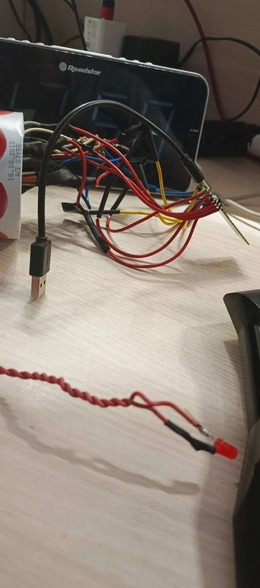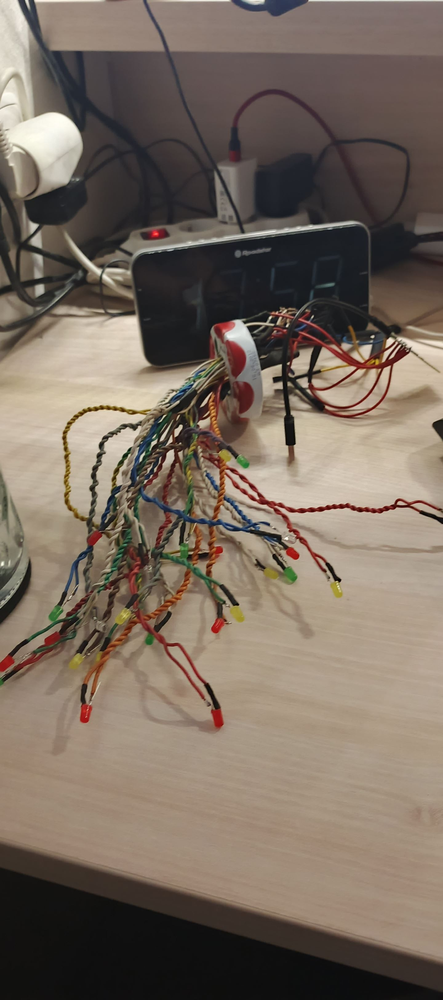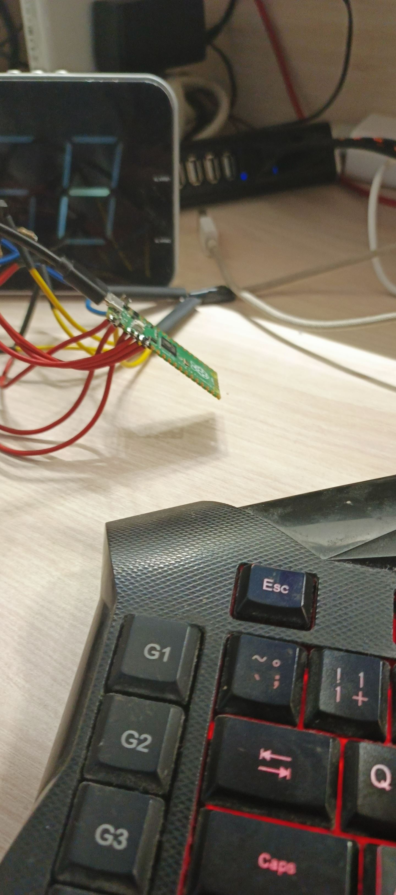

### V0.4 NRTV
veze která má krycí jméno nemám rád tuhle verzi asi mluví za vše....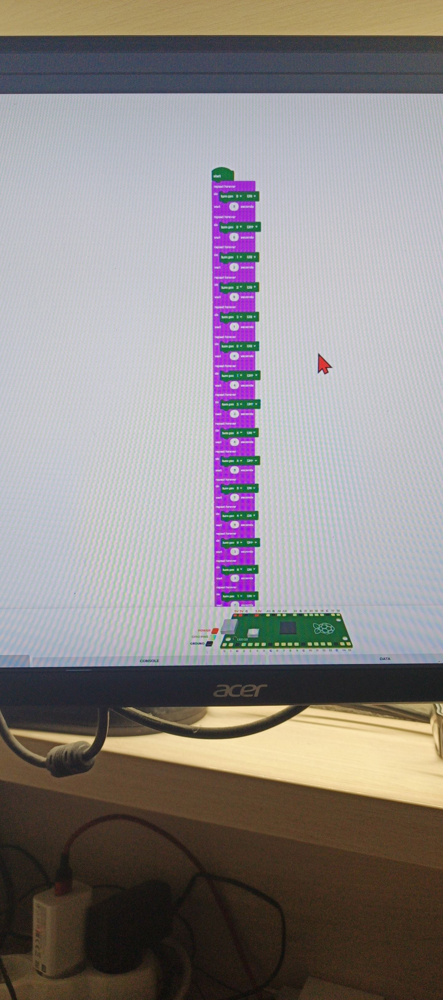
programoval jsem v Piper Make což mi přišlo hezky grafické a pro děti takže se mi to líbilo...
ale po tak dvaceti pokusech toho nahrát ten jen blbý circuitpython který tato stránka generuje a zjištění že přes rozbočovací USB hub to nepůjde jsem byl již lehce zešedlý z naštvání a nezvladatelný a absolutně do teď nechápu v čem je problem USB hub 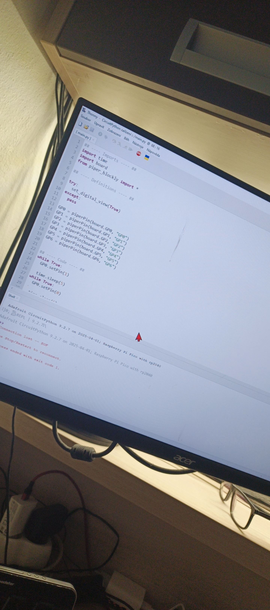
no a tady moje cesta skončila po zapojení do elektřiny ač jsem podle sveho uvažování i uvažovaní asi tří umělých inteligencí které jak mohu podotknout v oblasti programování a elektra občas fakticky pokulhávají jsem ztratil nervy opravdu nevím kde je problém rasbery pi pico po zapojení elektřiny bliká jakože je v provozu ale žádná z ledek senerozsvěcíí ano pokud se ptáte tak ano program se jmenuje main.py aby mel tendence se spouštět sám dokonce bych i řekl že se spouští sám jen se bojím toho že to neumím naprogramovat správně :) 

## Nápad který přišel s nedostatkem času
vzhledem k tomu že jsem nezlob se  můj projekte mel lepší věci co na práci tak mne napadlo jelikož se tyto věci většinou také týkají elektra je sem stručně dáti jsou to povětšinou opravy některé hotové jiné plánované takže netuším jestli by se k nim neměla dát nějaká citace netuším ale zkusím tam dát cíle projektu alespoň.:)

### Parkside nabíječka 
cíl miniprojektoopray opravit nabíječku na parkside akumulátory pro strýce co nejlevnějii

tohoto typu měla jednoduše diagnostikovatelnou poruchu řekněme že byla viditelná již při rozdělání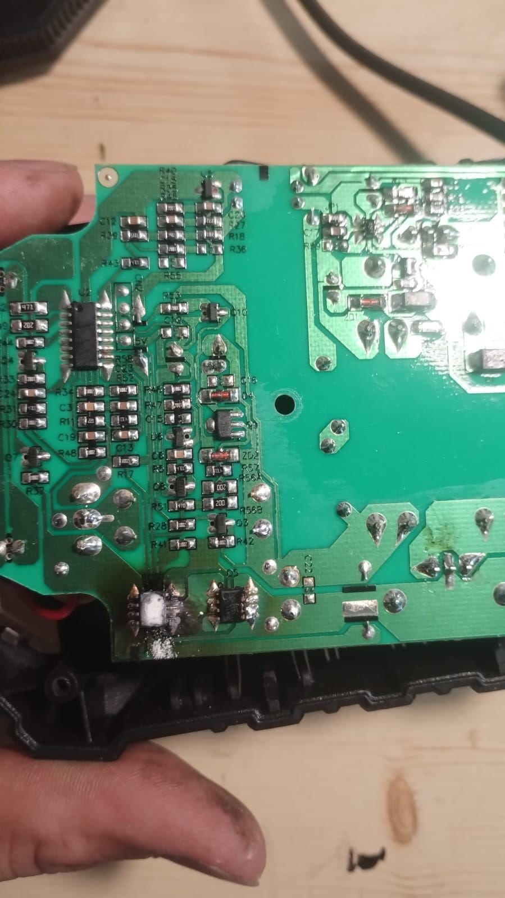
problém s touto poruchou byl že i navzdory tomu že všechny integráče a součástky jsou na této desce popsány což je chvályhodné mnoho čínských výrobců praktikuje jak já je nazývám integráče zrozené s deskou (integráče které nemají žádný kód na sobě trudíš člověk nemá šanci zjistit co se uvnitř skrývá) každopádně i na vzdory tomuto skvělému popsání jak je vidno na obrázku tak se popsání lehounce vypařilo takže přišla na řadu teoretická část myšlenky byly následovné:
1. je tam vysoká podoba s integráčem napravo od něj.
2. je stejné jen pootočené zapojení jako u integráče napravo neboli jedna strana spojené a druhá oddělena jen jedna noha takže stejná tří nožičková součástka
3. už bylo vážně teoretizování s ohledem že mi zatím věci do sebe pasovali nejspíše to bude nějaký druh tranzistoru s ohledem na to že jsou připojeny na konektory baterie a budou určovat jestli je baterie nabytá či nikoliv a bylo to vskutku tak.
a tak jsem s dalšími obtížemi luštil druhý nápis na integráči a našel jsem že je to vskutku tranzistor unipolární a tak přišlo na řadu shánění v čemž je nutno uznat že je výborným pomocníkem umělá inteligence napíšete součástku její hlavní podmínky pro danou aplikaci a ona nalezne vhodnou náhradu(což většina mých oprav to vyžaduje nepřipadá totiž v úvahu abych za součástky platil poštovné které je častokrát dvojnásobek součástky takže Ecom v Českém Meziříčí kde jim ale spousta součástek chybí)

Nabíječka vskutku funguje a nabíjí tak jak má.

### Květina která neuschne
cílem bylo obdarovat moji přítelkyní s kterou jsme měli výročí a tak jsem přemýšlel co ji dát a vzhledem k tomu že má přítelkyně ráda dárky vyráběla tak jsem chtěl také něco vyrobit aby to bylo vyloženě ode mne nenapadlo mne ovšem nic jiného než recyklovat hromadu kovového drátu ze staré proužky a udělat z něho květinu (byla to hrozná piplačka a propálil jsem si prst nikdy více kreativita)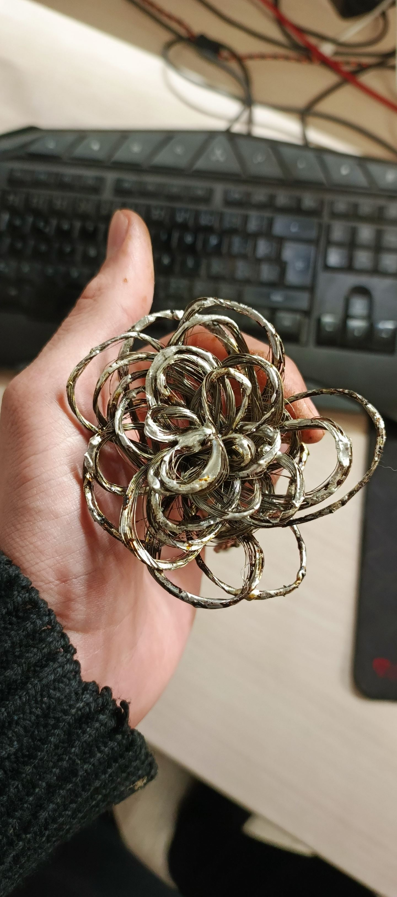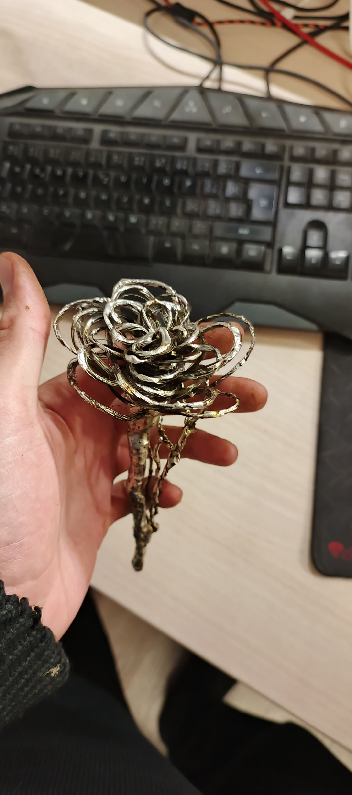
květina se líbila a nebojte byl použit bezolovnatý cín takovou ekologickou katastrofu bych nedopustil.

### Test a externí přenosný proudový chránič
cílem bylo otestovat funkčnost čínského proudového chrániče z aliexpresu který jsem nejdříve otestoval pouhým zapojováním nízko odběrových věcí na zem a ne na nulu no prostě klasika každopádně potom co jsem to otestoval byl cíl ho udělat přenosný ale zároveň skladný a jednoduchý takže jsem si sehnal malou elektro krabičku do ní standardní zásuvku do zdi od ABB která tam dílky super dírce se závitem šla velice dobře přidělat a také přívodní kabel a tak jsem si udělal přenosný proudový chránič který je v našem domě bez proudového chrániče užitečný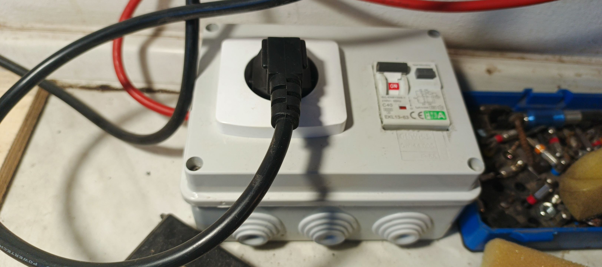

## Věci co nejsou dokončené ale čekají popřípadě nejsou odzkoušené 
jeden zesilovač na reproduktory do auta bohužel nemám na čem vyzkoušet ale vyřešil jsem problém s vysokým odběrem (při zapojení na ideální zdroj to skočilo na hranici 10 ampér takže nebýt hranice pojistka by byla kaput tento problém vyřešen čekám na nějaký konektor nebo reproduktor)  výměnou bipolárního tranzistoruu PNP 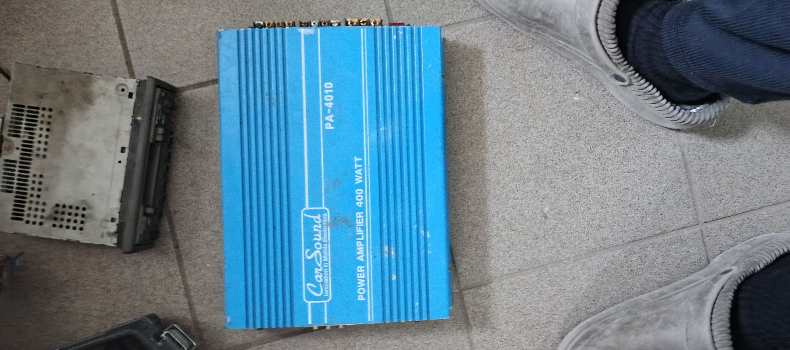

rozdělaná parkside baterie na kterou nebyl čas kvůli projektu :)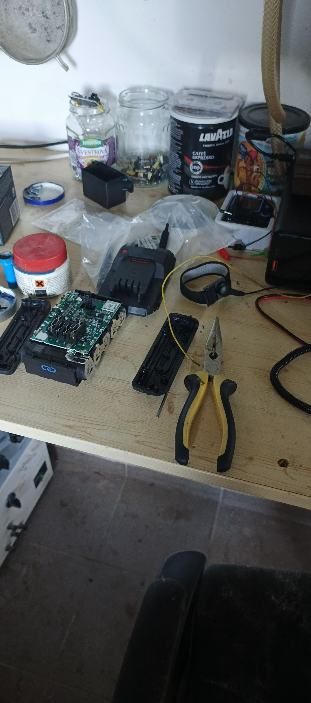
 
a jedna rozbuška čekající v pořadí 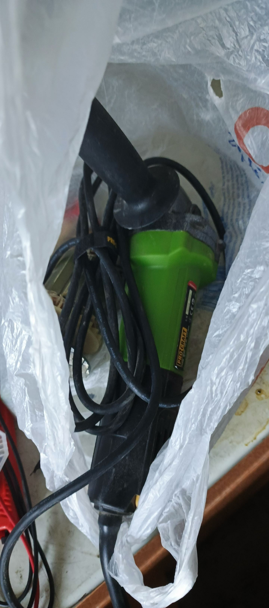

Samozřejmě je toho mnohem více a to je důvod proč jsem se uchýlil k tomu sem dát více menších projektů za poslední dobu spíše než týden trávit na dekoraci.