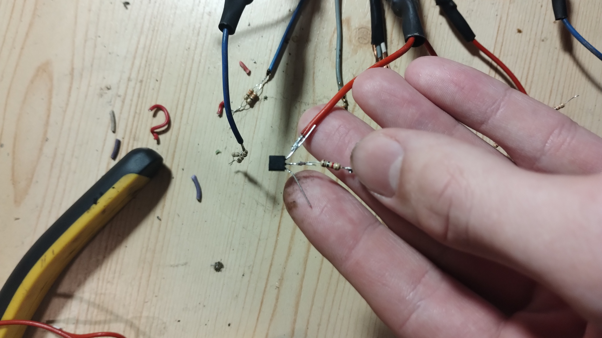
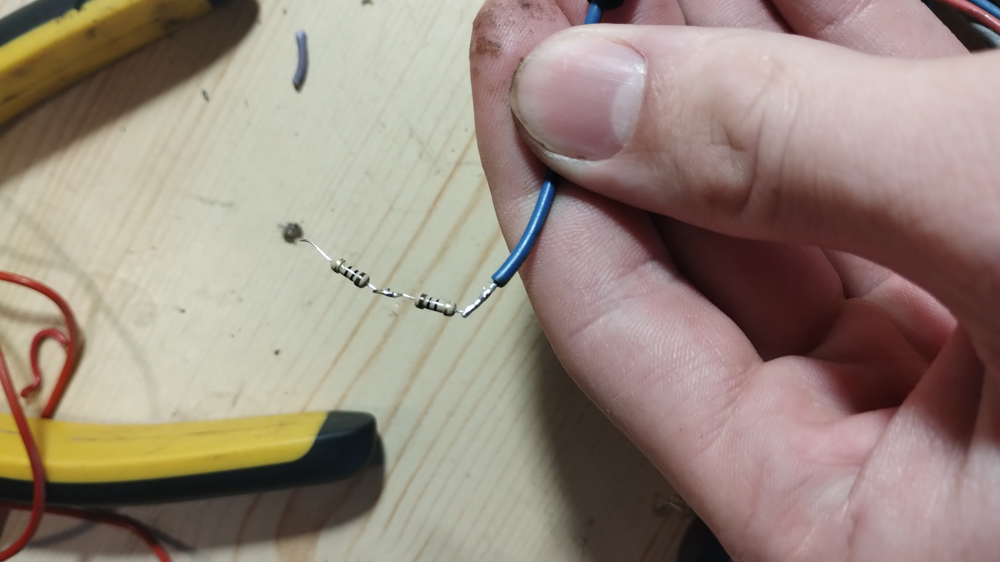
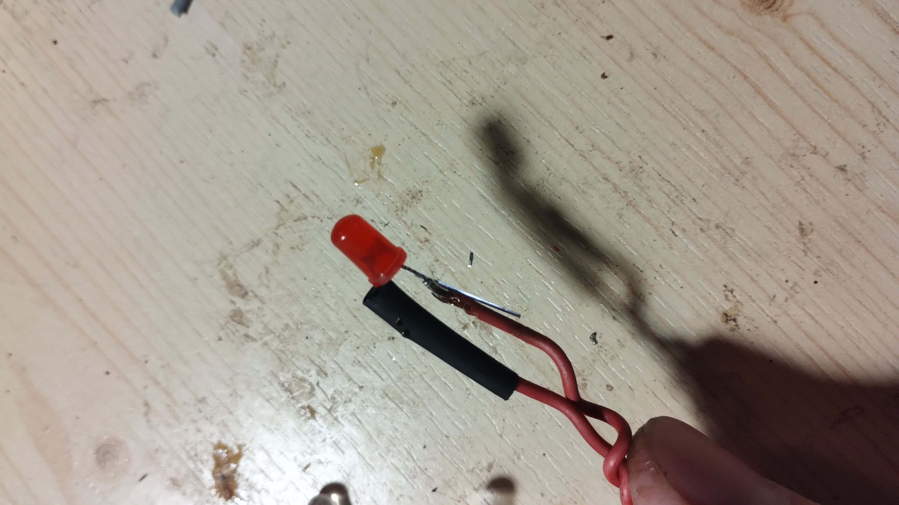
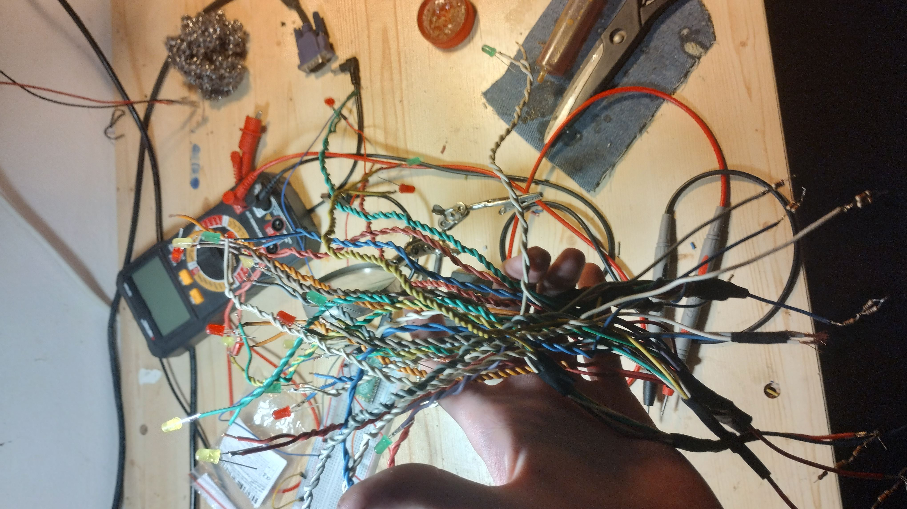
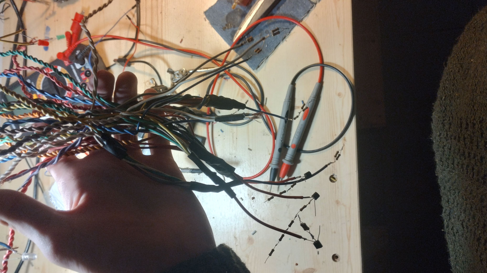
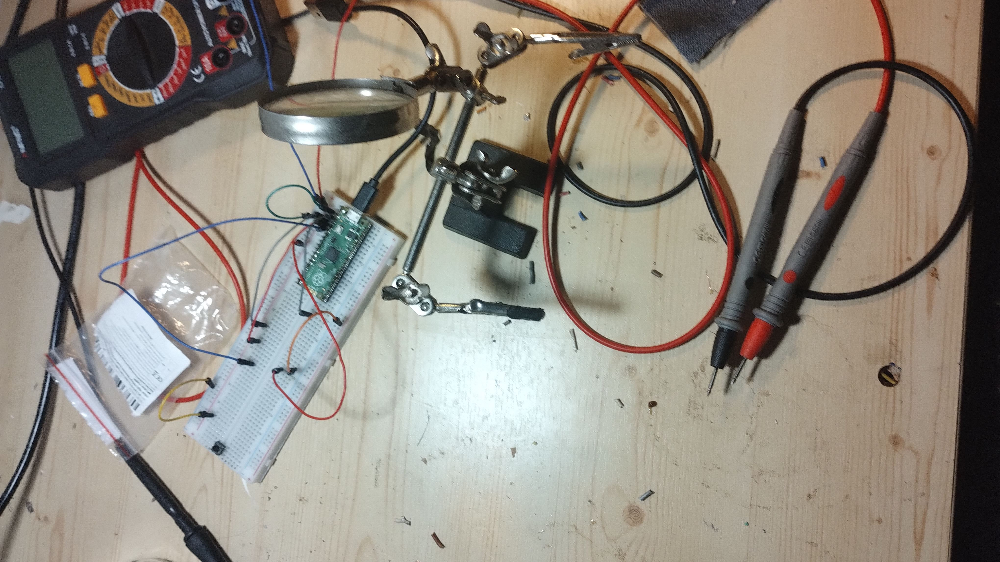

# LED stromeček
## Cíl projektu
Cílem projektu je  splnění zadání ze školy:) ale také jsem chtěl využít rasbery pi pico a také se naučit nějaké základy rasbery pi pico. a jako bonus je sestrojení (doufejme) hezké dekorace.
## Z čeho se muj projekt skládá:
Rasbery pi pico: 

použito jakožto řídící jednotka 

Tranzisory:

3x P2N2222A použito jakožto spínač pro větší větve s diodami protože by měli větší proud než je povoleno pro jednotlivé výstupy (GPIOX)

Ochrané rezistory:

330R 9x

10K 2x

10R 7x

1K 2x

220 2x

Ochranné rezistory slouží k ochraně diod proti nadměrnému napětí a proudu.

Led diody:

25x ruzné barvy 

"Chuchvalec" starých elektrických drátů z auta:

## Elektrotechnické schéma:

Vytvořeno v Tinkercad
## Verze
### V0.1 NF
Tato verze je NF jako: nefunkční nebo not finished. V teto verzi je hotovo asi 68% projektu diody pripajená pouze anoda katoda v procesu. Tranzistory připájené i s ochranými odpory 

### V0.2
Napájení katod a průběžné řešení izolace u jedné z elektrod diody a příprava pripájení Rasbery pi pico a spojování jednotlivých větví více ve videu 

[Video V0.2](https://drive.google.com/file/d/1NQ10m_3WI_LUUCVfmrpTRvGcRcWG3vj5/view?usp=sharing)
